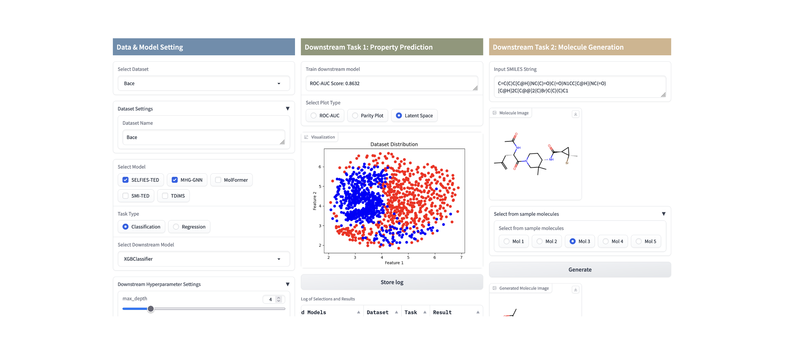

# Introduction to IBM Foundation Models for Materials (FM4M)


[](https://github.com/MShawon/github-clone-count-badge)


Welcome to IBM’s multi-modal foundation model for materials, FM4M. This model is designed to support and advance research in materials science and chemistry. FM4M consists of a diverse set of uni-modal models, each pre-trained with distinct representations and modalities, such as SMILES, SELFIES, molecular graphs, 3D atom positions, 3D density grids, and other representations. By fine-tuning with domain-specific data, FM4M can be applied to various downstream tasks, including predictive and generative functions. Starting with a few uni-modal models, we will release diverse models progressively.

📢 **Exciting Update!** Our next event is coming soon. Click [**here**](#-events) to learn more!

## Model Architecture

FM4M adopts a modular architecture designed for flexible extensibility. As illustrated in the figure below, it comprises both uni-modal and fused models. Each uni-modal model is pre-trained independently for its respective modality (e.g., SMILES), and users can access individual functionalities directly from the corresponding model directory (e.g., smi-ted/).
Some of these uni-modal models can be "late-fused" using fusion algorithms, creating a more powerful multi-modal feature representation for downstream predictions. To simplify usage, we provide fm4m-kit, a wrapper that enables users to easily access the capabilities of all models through straightforward methods. These models are also available on Hugging Face, where they can be accessed via an intuitive and user-friendly GUI.


## Repository Structure

The structure of IBM's materials family of foundation models is organized as follows:

```
materials/
├── models/
    ├── smi_ted/
    ├── smi_ssed/
    ├── selfies_ted/
    ├── mhg_model/
    ├── fm4m.py
    ...
├── examples/
    ├── fm4m_example.ipynb
    ├── battery_example.ipynb
    ...  
```

Each folder represents a different chemical representation and architecture type. The repository will be continuously updated with new models, improvements, and additional documentation.

## Supported Models
| Model            |Description|
|------------------|-----------|
| SMI-TED [\[HuggingFace\]](https://huggingface.co/ibm/materials.smi-ted) | SMILES-based Transformer Encoder-Decoder (SMILES-TED) is an encoder-decoder model pre-trained on a curated dataset of 91 million SMILES samples sourced from PubChem, equivalent to 4 billion molecular tokens. SMI-TED supports various complex tasks, including quantum property prediction, with two main variants ($289M$ and $8 \times 289M$). |
| SMI-SSED [\[HuggingFace\]](https://huggingface.co/ibm/materials.smi-ted) | SMI-SSED (SMILES-SSED) is a Mamba-based encoder-decoder model pre-trained on a curated dataset of 91 million SMILES samples, encompassing 4 billion molecular tokens sourced from PubChem. The model is tailored for complex tasks such as quantum property prediction and offers efficient, high-speed inference capabilities. |
| SELFIES-TED [\[HuggingFace\]](https://huggingface.co/ibm/materials.selfies-ted) | SELFIES-based Transformer Encoder-Decoder (SELFIES-TED) is an encoder-decoder model based on BART that not only learns molecular representations but also auto-regressively generates molecules. Pre-trained on a dataset of ~1B molecules from PubChem and Zinc-22 |
| MHG-GED [\[HuggingFace\]](https://huggingface.co/ibm/materials.mhg-ged) | Molecular Hypergraph Grammar with Graph-based Encoder Decoder (MHG-GED) is an autoencoder that combines a GNN-based encoder with a sequential MHG-based decoder. The GNN encodes molecular input to achieve strong predictive performance on molecular graphs, while the MHG decodes structurally valid molecules. Pre-trained on a dataset of ~1.34M molecules curated from PubChem|


## Getting Started

To install the required packages and set up a virtual environment using Conda, follow the steps below:

### 1. Create a Conda Virtual Environment

To install the required packages and set up a virtual environment using Conda (with Python 3.9.7 or later), follow the steps below:

```bash
# Create a virtual environment named `fm4m`
conda create --name fm4m python=3.9.7

# Activate the virtual environment
conda activate fm4m
```

### 2. Install Required Packages

After activating your Conda environment, install the required packages using the following command:

```bash
# Install dependencies from requirements.txt
pip install -r requirements.txt
```
### 3. Usages
### 3-1. Individual model access
One way to utilize FM4M is by accessing each uni-modal model individually. Within each model’s folder (e.g., SMI-TED), you’ll find comprehensive documentation and example notebooks to guide effective usage. This approach allows users to explore and apply each model’s specific functions in detail.

### 3-2. FM4M-Kit (a wrapper toolkit)
A more streamlined approach is to use FM4M-Kit, a wrapper toolkit that enables users to work with all models within a unified framework. The example notebook, [fm4m-example.ipynb](https://github.com/IBM/materials/blob/main/examples/fm4m_example.ipynb), provides step-by-step instructions for feature extraction with each model, as well as for multi-modal integration. It supports both downstream regression and classification tasks, featuring an XGBoost model for these purposes. In the near future, more functions and downstream models will be implemented.

#### Retrieving feature representations
To extract representations from a specific model (e.g., `selfies-ted`), call the following api:
```bash
# Replace model parameter with any other model name supported by FM4M-Kit
feature_selfies_train = fm4m.get_representation(model="selfies-ted", data=xtrain)
```

#### Downstream modeling and evaluation by a uni-modal model
To evaluate the performance of a uni-modal model (e.g., `mhg-ged`), the following example demonstrates how to perform a regression task:
```bash
# Replace model and task parameters depending on your requirement
score = fm4m.single_modal(model="MHG-GED", x_train=xtrain, y_train=ytrain, x_test=xtest, y_test=ytest, downstream_model="DefaultClassifier")
```                  

#### Downstream modeling and evaluation by a multi-modal model
For multi-modal model evaluation (e.g., `smi-ted`, `mhg-ged`, and `selfies-ted`), simply list the models as follows:
```bash
# Replace model_list and task parameters depending on your requirement
score = fm4m.multi_modal(model_list=["SELFIES-TED","MHG-GED","SMI-TED"], x_train=xtrain, y_train=ytrain, x_test=xtest, y_test=ytest, downstream_model="DefaultClassifier")
```

### 3-3. Web UI
The easiest approach is to use FM4M-Kit through a web UI available on Hugging Face Space. This intuitive interface allows you to access FM4M-Kit functions, including data selection, model building, training for downstream tasks, and basic result visualization.



## Collaboration and Community

We strongly believe in the power of collaboration and community-driven development to propel AI forward. We hope that the AI community will find our efforts useful and that our models help advance research and innovation in materials science.

We welcome contributions from the community! If you have any ideas, improvements, or new models you'd like to share, please feel free to contact. 
For any questions, suggestions, or feedback, please open an issue on GitHub.

We are especially promoting open development of FM4M through a working group in [AI Alliance <space>](https://thealliance.ai/). Within this group, we organize technical meetings, hands-on seminars, and social events at leading AI conferences.

## 📅 Events

Stay updated on our upcoming events and join us to connect, learn, and engage!

- **26 July 2024**: **ICML 2024 AI for Science**, [Social Night with AI Alliance](https://icml.cc/virtual/2024/workshop/29973), Vienna.
  
- **29 October 2024**: **Acceleration Consortium Fall Research Symposium**  
  *Demo & Hands-on for FM4M, Toronto.* [Event Link](https://acceleration.utoronto.ca/events/acceleration-consortium-fall-research-symposium?utm_source=substack&utm_medium=email)

- **28 November 2024**: **ChemAI Satellite Events**  
  *Get Hands-On with Open Multi-Modal Foundation Models for Materials and Chemistry.*
  
- **11 December 2024**: **NeurIPS 2024 Social Event**  
  *"Breaking Silos: Open Community for AI x Science", Vancouver.*  [Webpage](https://sites.google.com/view/breaking-silos-open-ai4science/)
  
- **4 March 2025**: **AAAI 2025 Hands-on Demonstration**  
  *"A Hands-on Demonstration of an Open Foundation Model for Materials and Chemistry", Philadelphia.*  [Webpage](https://the-ai-alliance.github.io/AAAI-25-Workshop-on-Open-Source-AI-for-Mainstream-Use/)


## Related Publications
Only one representative paper for each model is listed here. For a complete list of publications, please refer to each model’s README page.
- SMILES-TED: ["A Large Encoder-Decoder Family of Foundation Models For Chemical Language" ](https://doi.org/10.48550/arXiv.2407.20267) (arXiv paper)
- SMILES-SSED: ["A Mamba-Based Foundation Model for Chemistry" ](https://openreview.net/pdf?id=HTgCs0KSTl) (NeurIPS 2024, AI4Mat)
- SELFIES-TED: ["SELF-BART: A Transformer-based Molecular Representation Model using SELFIES"](https://doi.org/10.48550/arXiv.2410.12348) (NeurIPS 2024, AI4Mat)
- MHG-GNN: ["MHG-GNN: Combination of Molecular Hypergraph Grammar with Graph Neural Network"](https://arxiv.org/pdf/2309.16374)  (NeurIPS 2023, AI4Mat)
- Overview: ["Foundation Model for Material Science"](https://ojs.aaai.org/index.php/AAAI/article/view/26793) (AAAI 2023, SMTP) 

## Credits (as of 28 October)
Dmitry Zubarev, Eduardo Soares, Emilio Ashton Brazil, Flaviu Cipcigan, Indra Priyadarsini, Lisa Hamada, Seiji Takeda, Shinnosuke Tanaka, Victor Shirasuna, Zeynep Sümer.
