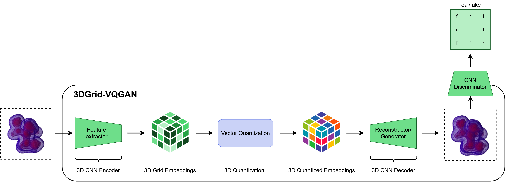

# 3D Electron Density Grids-based VQGAN (3DGrid-VQGAN)

This repository provides PyTorch source code associated with our publication, "A Foundation Model for Simulation-Grade Molecular Electron Densities".

**Paper:** [ICLR 2025 Workshop Link](https://openreview.net/forum?id=9O4KmwYma0)

**HuggingFace:** [HuggingFace Link](https://huggingface.co/ibm-research/materials.3dgrid_vqgan)

For more information contact: eduardo.soares@ibm.com or evital@br.ibm.com.



## Introduction

We present an encoder-decoder chemical foundation model for representing 3D electron density grids, 3DGrid-VQGAN, pre-trained on a dataset of approximately 855K molecules from PubChem database. 3DGrid-VQGAN efficiently encodes high-dimensional data into compact latent representations, enabling downstream tasks such as molecular property prediction with enhanced accuracy. This approach could significantly reduce reliance on computationally intensive quantum chemical simulations, offering simulation-grade data derived directly from learned representations.

## Table of Contents

1. [Getting Started](#getting-started)
   1. [Pretrained Models and Training Logs](#pretrained-models-and-training-logs)
   2. [Replicating Conda Environment](#replicating-conda-environment)
2. [Pretraining](#pretraining)
3. [Finetuning](#finetuning)
4. [Feature Extraction](#feature-extraction)

## Getting Started

**This code and environment have been tested on Nvidia V100s and Nvidia A100s**

### Pretrained Models and Training Logs

Add the 3DGrid-VQGAN `pre-trained weights.pt` to the `data/checkpoints/pretrained` directory. The directory structure should look like the following:

```
data/
└── checkpoints/
    └── pretrained/
        └── 3DGrid-VQGAN_43.pt
```

### Replicating Conda Environment

Follow these steps to replicate our Conda environment and install the necessary libraries:

#### Create and Activate Conda Environment

```
conda create --name 3dvqgan-env python=3.10
conda activate 3dvqgan-env
```

#### Install Packages with Conda

```
conda install pytorch=2.1.0 pytorch-cuda=11.8 -c pytorch -c nvidia
conda install -c conda-forge mpi4py=4.0.0 openmpi=5.0.5
```

#### Install Packages with Pip

```
pip install -r requirements.txt
```

## Pretraining

3DGrid-VQGAN is pre-trained on approximately 855K 3D electron density grids from PubChem, yielding approximately 7TB of data.

The pretraining code provides examples of data processing and model training on a smaller dataset.

To pre-train the 3DGrid-VQGAN model, run:

```
bash training/run_mpi_training.sh
```

## Finetuning

The finetuning datasets and environment can be found in the [finetune](finetune/) directory. After setting up the environment, you can run a finetuning task with:

```
bash finetune/run_finetune_qm9_alpha.sh
```

Finetuning training/checkpointing resources will be available in directories named `data/checkpoints/finetuned/<dataset_name>/<measure_name>`.

## Feature Extraction

To extract the embeddings from 3DGrid-VQGAN model, you can simply use:

```python
bash inference/run_extract_embeddings.sh
```
