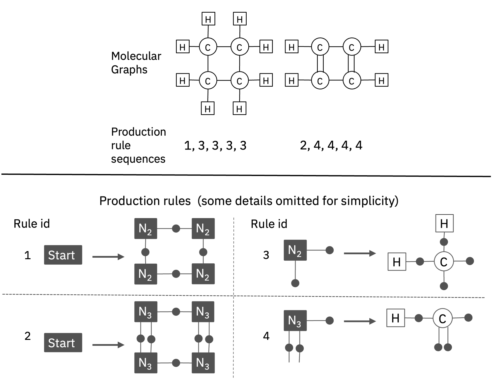

# mhg-gnn

This repository provides PyTorch source code assosiated with our publication, "MHG-GNN: Combination of Molecular Hypergraph Grammar with Graph Neural Network"

**Paper:** [Arxiv Link](https://arxiv.org/pdf/2309.16374)



## Introduction

We present MHG-GNN, an autoencoder architecture
that has an encoder based on GNN and a decoder based on a sequential model with MHG.
Since the encoder is a GNN variant, MHG-GNN can accept any molecule as input, and  
demonstrate high predictive performance on molecular graph data.
In addition, the decoder inherits the theoretical guarantee of MHG on always generating a structurally valid molecule as output.

## Table of Contents

1. [Getting Started](#getting-started)
    1. [Pretrained Models and Training Logs](#pretrained-models-and-training-logs)
    2. [Installation](#installation)
2. [Feature Extraction](#feature-extraction)

## Getting Started

**This code and environment have been tested on Intel E5-2667 CPUs at 3.30GHz and NVIDIA A100 Tensor Core GPUs.**

### Pretrained Models and Training Logs

We provide checkpoints of the MHG-GNN model pre-trained on a dataset of ~1.34M molecules curated from PubChem. (later) For model weights: [HuggingFace Link](https://huggingface.co/ibm/materials.mhg-ged/blob/main/mhggnn_pretrained_model_0724_2023.pickle)

Add the MHG-GNN `pre-trained weights.pt` to the `models/` directory according to your needs. 

### Installation

We recommend to create a virtual environment. For example:

```
python3 -m venv .venv
. .venv/bin/activate
```

Type the following command once the virtual environment is activated:

```
git clone git@github.ibm.com:CMD-TRL/mhg-gnn.git
cd ./mhg-gnn
pip install .
```

## Feature Extraction

The example notebook [mhg-gnn_encoder_decoder_example.ipynb](notebooks/mhg-gnn_encoder_decoder_example.ipynb) contains code to load checkpoint files and use the pre-trained model for encoder and decoder tasks.

To load mhg-gnn, you can simply use:

```python
import torch
import load

model = load.load()
```

To encode SMILES into embeddings, you can use:

```python
with torch.no_grad():
    repr = model.encode(["CCO", "O=C=O", "OC(=O)c1ccccc1C(=O)O"])
```

For decoder, you can use the function, so you can return from embeddings to SMILES strings:

```python
orig = model.decode(repr)
```
