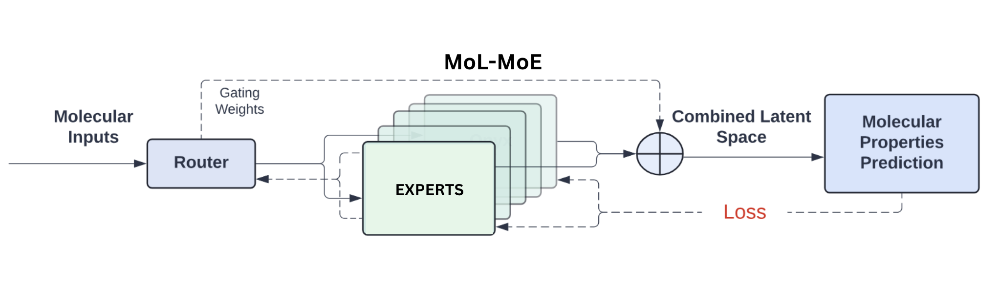

# MoL-MoE: Multi-view Mixture-of-Experts framework

This repository provides PyTorch source code of the framework MoL-MoE.

For more information contact: eduardo.soares@ibm.com or evital@br.ibm.com.



## Introduction

We present MoL-MoE, a Multi-view Mixture-of-Experts framework designed to predict molecular properties by integrating latent spaces derived from SMILES, SELFIES, and molecular graphs. Our approach leverages the complementary strengths of these representations to enhance predictive accuracy. Here, we evaluate the performance of MoL-MoE with a total of 12 experts, organized into 4 experts for each modality (SMILES, SELFIES, and molecular graphs).

## Table of Contents

1. [Getting Started](#getting-started)
   1. [Replicating Conda Environment](#replicating-conda-environment)
2. [Demos](#demos)

## Getting Started

**This code and environment have been tested on Nvidia V100s**

### Replicating Conda Environment

Follow these steps to replicate our Conda environment and install the necessary libraries:

#### Create and Activate Conda Environment

```
conda create --name mol-moe-env python=3.10
conda activate mol-moe-env
```

#### Install Packages with Conda

```
conda install pytorch=2.1.0 pytorch-cuda=11.8 -c pytorch -c nvidia
```

#### Install Packages with Pip

```
pip install -r requirements.txt
```

## Demos

Use the following notebooks depending of the number of activated experts `k=4` or `k=6` located at:

```
notebooks/
├── MoE_FM_Multi_output_BBBP_k=4.ipynb
└── MoE_FM_Multi_output_BBBP_k=6.ipynb
```

All used datasets can be found at `data/moleculenet/`. To change the dataset, just edit in the notebook the path with the name of the dataset:

```python
train_df = pd.read_csv("../data/moleculenet/bace/train.csv")
valid_df = pd.read_csv("../data/moleculenet/bace/valid.csv")
test_df  = pd.read_csv("../data/moleculenet/bace/test.csv")
```

For single task regression datasets, one may have to change the output dimension `output_dim` of the predictor to `1`:

```python
net = Net(smiles_embed_dim=2048, dropout=0.2, output_dim=1)
```

For multi-task datasets, the `output_dim` argument can be edited to the desired number of output predictions.


