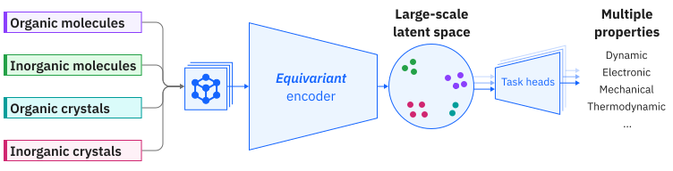

# Position-based Equivariant Graph Neural Network (`pos-egnn`)
This repository contains PyTorch source code for loading and performing inference using the `pos-egnn`, a foundation model for Chemistry and Materials.

**GitHub**: https://github.com/ibm/materials

**HuggingFace**: https://huggingface.co/ibm-research/materials.pos-egnn

<p align="center">
    
</p>

## Introduction
We present `pos-egnn`, a Position-based Equivariant Graph Neural Network foundation model for Chemistry and Materials. The model was pre-trained on 1.4M samples (i.e., 90%) from the Materials Project Trajectory (MPtrj) dataset to predict energies, forces and stress. `pos-egnn` can be used as a machine-learning potential, as a feature extractor, or can be fine-tuned for specific downstream tasks.

Besides the model weigths `pos-egnn.v1-6M.pt`, which can be downloaded from [HuggingFace](https://huggingface.co/ibm-research/materials.pos-egnn), we also provide examples for performing inference, feature extraction and molecular dynamics simulation with the model (`example.ipynb`).

For more information, please reach out to rneumann@br.ibm.com and/or flaviu.cipcigan@ibm.com

## Table of Contents
1. [**Getting Started**](#getting-started)
2. [**Example**](#example)

## Getting Started
Follow these steps to replicate our environment and install the necessary libraries:

First, make sure to have Python 3.11 installed. Then, to create the virtual environment, run the following commands:

```bash
python3.11 -m venv env
source env/bin/activate
```

Run  the following command to install the library dependencies.

```bash
pip install -r requirements.txt
```

## Example
Please refer to the `example.ipynb` for a step-by-step demonstration on how to perform inference, feature extraction and molecular dynamics simulation with the model.
