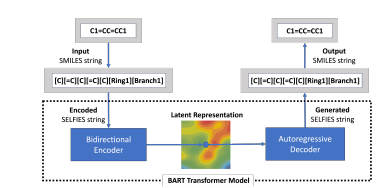

# selfies-ted

selfies-ted is a project for encoding SMILES (Simplified Molecular Input Line Entry System) into SELFIES (SELF-referencing Embedded Strings) and generating embeddings for molecular representations.


## Model Architecture

Configuration details

Encoder and Decoder FFN dimensions: 256
Number of attention heads: 4
Number of encoder and decoder layers: 2
Total number of hidden layers: 6
Maximum position embeddings: 128
Model dimension (d_model): 256

## Pretrained Models and Training Logs
We provide checkpoints of the selfies-ted model pre-trained on a dataset of molecules curated from PubChem. The pre-trained model shows competitive performance on molecular representation tasks. For model weights: "HuggingFace link".

To install and use the pre-trained model:

Download the selfies_ted_model.pkl file from the "HuggingFace link".
Add the selfies-ted selfies_ted_model.pkl to the models/ directory. The directory structure should look like the following:

```
models/
└── selfies_ted_model.pkl
```

## Installation

To use this project, you'll need to install the required dependencies. We recommend using a virtual environment:

```bash
python -m venv venv
source venv/bin/activate  # On Windows use `venv\Scripts\activate`
```

Install the required dependencies

```
pip install -r requirements.txt
```


## Usage

### Import

```
import load
```
### Training the Model

To train the model, use the train.py script:

```
python train.py -f <path_to_your_data_file>
```


Note: The actual usage may depend on the specific implementation in load.py. Please refer to the source code for detailed functionality.

### Load the model and tokenizer
```
load.load("path/to/checkpoint.pkl")
```
### Encode SMILES strings
```
smiles_list = ["COC", "CCO"]
```
```
embeddings = load.encode(smiles_list)
```


## Example Notebook

Example notebook of this project is `selfies-ted-example.ipynb`. 
