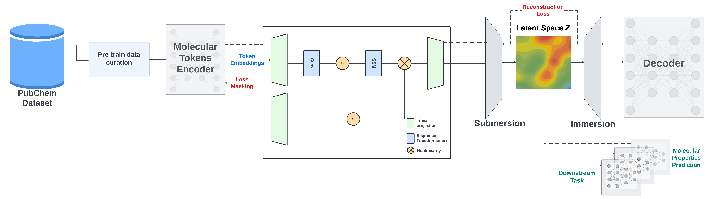

# Mamba-based Encoder-Decoder for SMILES (SMI-SSED)

This repository provides PyTorch source code associated with our publication, "A Mamba-Based Foundation Model for Chemistry".

**Paper NeurIPS AI4Mat 2024:** [Arxiv Link](https://openreview.net/pdf?id=HTgCs0KSTl)

**HuggingFace:** [HuggingFace Link](https://huggingface.co/ibm/materials.smi_ssed)

For more information contact: eduardo.soares@ibm.com or evital@br.ibm.com.



## Introduction

We present a large encoder-decoder chemical foundation model, SMILES-based State-Space Encoder-Decoder (SMI-SSED), pre-trained on a curated dataset of 91 million SMILES samples sourced from PubChem, equivalent to 4 billion molecular tokens. SMI-SSED supports various complex tasks, including quantum property prediction, with two main variants ($336$ and $8 \times 336M$). Our experiments across multiple benchmark datasets demonstrate state-of-the-art performance for various tasks. Model weights are available at: [HuggingFace Link](https://huggingface.co/ibm/materials.smi_ssed).

## Table of Contents

1. [Getting Started](#getting-started)
    1. [Pretrained Models and Training Logs](#pretrained-models-and-training-logs)
    2. [Replicating Conda Environment](#replicating-conda-environment)
2. [Pretraining](#pretraining)
3. [Finetuning](#finetuning)
4. [Feature Extraction](#feature-extraction)

## Getting Started

**This code and environment have been tested on Nvidia V100s and Nvidia A100s**

### Pretrained Models and Training Logs

We provide checkpoints of the SMI-SSED model pre-trained on a dataset of ~91M molecules curated from PubChem. The pre-trained model shows competitive performance on classification and regression benchmarks from MoleculeNet. For model weights: [HuggingFace Link](https://huggingface.co/ibm/materials.smi-ted)

Add the SMI-SSED `pre-trained weights.pt` to the `inference/` or `finetune/` directory according to your needs. The directory structure should look like the following:

```
inference/
├── smi_ssed
│   ├── smi_ssed.pt
│   ├── bert_vocab_curated.txt
│   └── load.py
```
and/or:

```
finetune/
├── smi_ssed
│   ├── smi_ssed.pt
│   ├── bert_vocab_curated.txt
│   └── load.py
```

### Replicating Conda Environment

Follow these steps to replicate our Conda environment and install the necessary libraries:

#### Create and Activate Conda Environment

```
conda create --name smi-ssed-env python=3.10
conda activate smi-ssed-env
```

#### Install Packages with Conda

```
conda install pytorch=2.1.0 pytorch-cuda=11.8 -c pytorch -c nvidia
```

#### Install Packages with Pip

```
pip install -r requirements.txt
```

## Pretraining

For pretraining, we use two strategies: the masked language model method to train the encoder part and an encoder-decoder strategy to refine SMILES reconstruction and improve the generated latent space.

SMI-SSED is pre-trained on canonicalized and curated 91M SMILES from PubChem with the following constraints:

- Compounds are filtered to a maximum length of 202 tokens during preprocessing.
- A 95/5/0 split is used for encoder training, with 5% of the data for decoder pretraining.
- A 100/0/0 split is also used to train the encoder and decoder directly, enhancing model performance.

The pretraining code provides examples of data processing and model training on a smaller dataset, requiring 8 A100 GPUs.

To pre-train the SMI-SSED model, run:

```
bash training/run_model_training.sh
```

Use `train_model_D.py` to train only the decoder or `train_model_ED.py` to train both the encoder and decoder.

## Finetuning

The finetuning datasets and environment can be found in the [finetune](finetune/) directory. After setting up the environment, you can run a finetuning task with:

```
bash finetune/smi_ssed/esol/run_finetune_esol.sh
```

Finetuning training/checkpointing resources will be available in directories named `checkpoint_<measure_name>`.

## Feature Extraction

The example notebook [smi_ssed_encoder_decoder_example.ipynb](notebooks/smi_ssed_encoder_decoder_example.ipynb) contains code to load checkpoint files and use the pre-trained model for encoder and decoder tasks. It also includes examples of classification and regression tasks. For model weights: [HuggingFace Link](https://huggingface.co/ibm/materials.smi-ted)

To load smi-ssed, you can simply use:

```python
model = load_smi_ssed(
    folder='../inference/smi_ssed',
    ckpt_filename='smi_ssed.pt'
)
```

To encode SMILES into embeddings, you can use:

```python
with torch.no_grad():
    encoded_embeddings = model.encode(df['SMILES'], return_torch=True)
```
For decoder, you can use the function, so you can return from embeddings to SMILES strings:

```python
with torch.no_grad():
    decoded_smiles = model.decode(encoded_embeddings)
```

