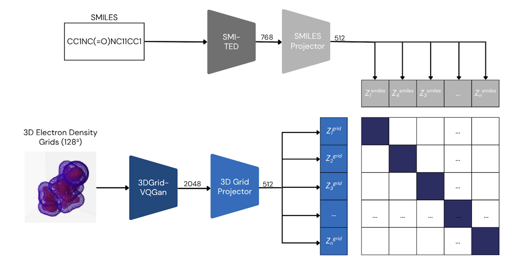

# SMILES and 3D Electron Density Grids-based CLIP/SigLIP (SMILESDFT-CLIP/SigLIP)

This repository provides PyTorch source code associated with our publication, "Emergent SO(3)-Invariant Molecular Representations from Multimodal Alignment".

**Paper:** [NeurIPS 2025 Workshop Link](https://openreview.net/pdf?id=23S9eBBcgy)

**HuggingFace:** [HuggingFace Link](https://huggingface.co/ibm-research/materials.smilesdft-clip)

For more information contact: eduardo.soares@ibm.com or evital@br.ibm.com.



## Introduction

We present SMILESDFT-CLIP/SigLIP, an multimodal foundation model that jointly train a continuous 3D-field encoder, based on a vector-quantized generative adversarial network (VQGAN), and a SMILES-based transformer encoder on a dataset of 855,000 molecules, each represented by a DFT-computed electron density grid and a corresponding canonical SMILES string. Both CLIP-style and SigLIP contrastive objectives are used to align representations across modalities. Results suggest that contrastive multimodal pretraining can yield symmetry-aware molecular representations, even in the absence of explicit equivariant design.

## Table of Contents

1. [Getting Started](#getting-started)
   1. [Pretrained Models and Training Logs](#pretrained-models-and-training-logs)
   2. [Replicating Conda Environment](#replicating-conda-environment)
2. [Pretraining](#pretraining)
3. [Finetuning](#finetuning)
4. [Feature Extraction](#feature-extraction)

## Getting Started

**This code and environment have been tested on Nvidia V100s and Nvidia A100s**

### Pretrained Models and Training Logs

Add the SMILESDFT-CLIP/SigLIP `pre-trained weights.pt` to the `data/checkpoints/VARIANT/pretrained` directory. The directory structure should look like the following:

```
data/
└── checkpoints/
    ├── clip/
    │   └── pretrained/
    │       └── SMILESDFT-CLIP_96.pt
    └── siglip/
        └── pretrained/
            └── SMILESDFT-SigLIP_96.pt
```

### Replicating Conda Environment

Follow these steps to replicate our Conda environment and install the necessary libraries:

#### Create and Activate Conda Environment
```
conda create --name smilesdftclip python=3.10
conda activate smilesdftclip
```

#### Install Packages with Conda
```
conda install pytorch=2.0.1 pytorch-cuda=11.7 -c pytorch -c nvidia
conda install mpi4py=4.0.0 openmpi=5.0.5
```

#### Install Packages with Pip
```
pip install -r requirements.txt
```

## Pretraining

SMILESDFT-CLIP/SigLIP is pre-trained on approximately 855K pairs of 3D electron density grids and canonical SMILES from PubChem, yielding approximately 7TB of data.

The pretraining code provides examples of data processing and model training on a smaller dataset.

To pre-train the two variants of SMILESDFT-CLIP/SigLIP model, run:

```
bash training/run_training_CLIP.sh
```

or

```
bash training/run_training_SigLIP.sh
```

## Finetuning

The finetuning datasets and environment can be found in the [finetune](finetune/) directory. After setting up the environment, you can run a finetuning task with:

```
bash finetune/run_finetune_qm9_u0.sh
```

Finetuning training/checkpointing resources will be available in directories named `data/checkpoints/VARIANT/finetuned/<dataset_name>/<measure_name>`.

## Feature Extraction

To extract the embeddings from SMILESDFT-CLIP/SigLIP model, you can simply use:

```python
bash inference/run_extract_embeddings.sh
```
