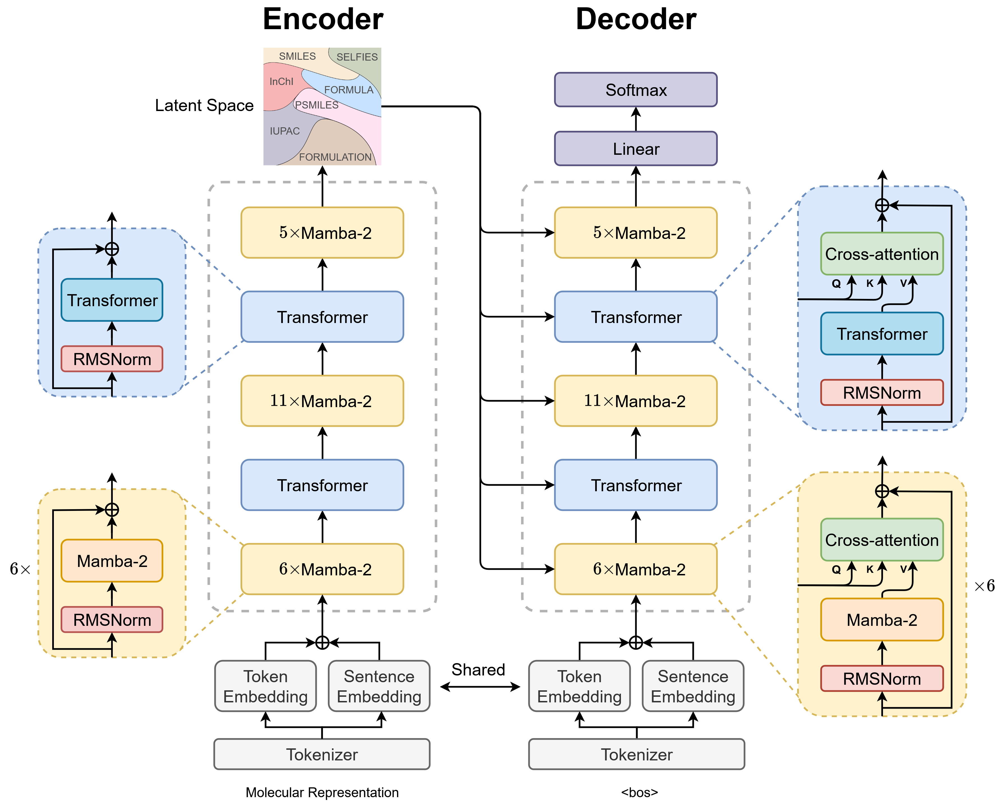

# Molecular String-based Bamba Encoder-Decoder (STR-Bamba)

This repository provides PyTorch source code associated with our publication, "STR-Bamba: Multimodal Molecular Textual Representation Encoder-Decoder Foundation Model".

**Paper:** [OpenReview Link](https://openreview.net/pdf?id=0uWNuJ1xtz)

**HuggingFace:** [HuggingFace Link](https://huggingface.co/ibm-research/materials.str-bamba)

For more information contact: vshirasuna@ibm.com or evital@br.ibm.com.



## Introduction

We present a large encoder-decoder chemical foundation model based on the IBM Bamba architecture, a hybrid of Transformers and Mamba-2 layers, designed to support multi-representational molecular string inputs. The model is pre-trained in a BERT-style on 588 million samples, resulting in a corpus of approximately 29 billion molecular tokens. These models serve as a foundation for language chemical research in supporting different complex tasks, including molecular properties prediction, classification, and molecular translation. **Additionally, the STR-Bamba architecture allows for the aggregation of multiple representations in a single text input, as it does not contain any token length limitation, except for hardware limitations.** Our experiments across multiple benchmark datasets demonstrate state-of-the-art performance for various tasks. Model weights are available at: [HuggingFace Link](https://huggingface.co/ibm-research/materials.str-bamba).

The STR-Bamba model supports the following **molecular representations**:
- SMILES
- SELFIES
- Molecular Formula
- InChI
- IUPAC Name
- Polymer SMILES in [SPG notation](https://openreview.net/pdf?id=L47GThI95d)
- Formulations

## Table of Contents

1. [Getting Started](#getting-started)
    1. [Pretrained Models and Training Logs](#pretrained-models-and-training-logs)
    2. [Replicating Conda Environment](#replicating-conda-environment)
2. [Pretraining](#pretraining)
3. [Finetuning](#finetuning)
4. [Feature Extraction](#feature-extraction)
5. [Citations](#citations)

## Getting Started

**This code and environment have been tested on Nvidia V100s and Nvidia A100s**

### Pretrained Models and Training Logs

We provide checkpoints of the STR-Bamba model pre-trained on a dataset of ~118M small molecules, ~2M polymer structures, and 258 formulations. The pre-trained model shows competitive performance on classification and regression benchmarks across small and polymer molecules, and electrolyte formulations. For model weights: [HuggingFace Link](https://huggingface.co/ibm-research/materials.str-bamba)

Add the STR-Bamba `pre-trained weights.pt` to the `inference/` or `finetune/` directory according to your needs. The directory structure should look like the following:

```
inference/
└── str_bamba/
    ├── config/
    ├── checkpoints/
    │   └── STR-Bamba_8.pt
    └── tokenizer/
```
and/or:

```
finetune/
└── str_bamba/
    ├── config/
    ├── checkpoints/
    │   └── STR-Bamba_8.pt
    └── tokenizer/
```

### Replicating Conda Environment

Follow these steps to replicate our Conda environment and install the necessary libraries:

#### Create and Activate Conda Environment
```shell
mamba create -n strbamba python=3.10.13
mamba activate strbamba
```

#### PyTorch 2.4.0 and CUDA 12.4
```shell
pip install torch==2.4.0 torchvision==0.19.0 torchaudio==2.4.0 --index-url https://download.pytorch.org/whl/cu124
```

#### Mamba2 dependencies:

Install the following packages in this order and with a **GPU**, because `mamba` depends on `causal-conv1d` to be installed.

```shell
# causal-conv1d
git clone https://github.com/Dao-AILab/causal-conv1d.git
cd causal-conv1d && git checkout v1.5.0.post8 && pip install . && cd .. && rm -rf causal-conv1d
```

```shell
# mamba
git clone https://github.com/state-spaces/mamba.git
cd mamba && git checkout v2.2.4 && pip install --no-build-isolation . && cd .. && rm -rf mamba
```

```shell
# flash-attn
pip install flash-attn==2.6.1 --no-build-isolation
```

#### Install Packages with Pip
```shell
pip install -r requirements.txt
```

#### Troubleshooting
```shell
pip install mamba-ssm==2.2.4
MAX_JOBS=2 pip install flash-attn==2.6.1 --no-build-isolation --verbose
```


## Pretraining

For pretraining, we use two strategies: the masked language model method to train the encoder part and a next token prediction strategy to train the decoder in order to refine molecular representation reconstruction and generation conditioned from the encoder.

The pretraining code provides examples of data processing and model training on a smaller dataset, requiring a A100 GPU.

To pre-train the two stages of the STR-Bamba model, run:

```
bash training/run_model_encoder_training.sh
```
or
```
bash training/run_model_decoder_training.sh
```

## Finetuning

The finetuning datasets and environment can be found in the [finetune](finetune/) directory. After setting up the environment, you can run a finetuning task with:

```
bash finetune/runs/esol/run_finetune_esol.sh
```

Finetuning training/checkpointing resources will be available in directories named `checkpoint_<measure_name>`.

## Feature Extraction

To load STR-Bamba, you can simply use:

```python
model = load_strbamba('STR-Bamba_8.pt')
```

To encode SMILES, SELFIES, InChI or other supported molecular representations into embeddings, you can use:

```python
with torch.no_grad():
    encoded_embeddings = model.encode(df['SMILES'], return_torch=True)
```
For decoder, you can use the following code, so you can generate new molecular representations conditioned from the encoder:

```python
with torch.no_grad():
    # encoder and decoder inputs
    encoder_input = '<smiles>CCO'
    decoder_input = '<smiles>'
    decoder_target = '<smiles>CCO'

    # tokenization
    encoder_input_ids = model.tokenizer(encoder_input, 
                                        padding=True, 
                                        truncation=True, 
                                        return_tensors='pt')['input_ids'].to(device)
    decoder_input_ids = model.tokenizer(decoder_input, 
                                        padding=True, 
                                        truncation=True, 
                                        return_tensors='pt')['input_ids'][:, :-1].to(device)
    decoder_target_ids = model.tokenizer(decoder_target, 
                                         padding=True, 
                                         truncation=True, 
                                         return_tensors='pt')['input_ids'].to(device)

    # visualize input texts
    print('Encoder input:', model.tokenizer.batch_decode(encoder_input_ids))
    print('Decoder input:', model.tokenizer.batch_decode(decoder_input_ids))
    print('Decoder target:', model.tokenizer.batch_decode(decoder_target_ids))
    print('Target:', decoder_target_ids)

    # encoder forward
    encoder_hidden_states = model.encoder(encoder_input_ids).hidden_states

    # model generation
    output = model.decoder.generate(
        input_ids=decoder_input_ids,
        encoder_hidden_states=encoder_hidden_states,
        max_length=decoder_target_ids.shape[1],
        cg=True,
        return_dict_in_generate=True,
        output_scores=True,
        enable_timing=False,
        temperature=1,
        top_k=1,
        top_p=1.0,
        min_p=0.,
        repetition_penalty=1,
    )

    # visualize model output
    generated_text = ''.join(
        ''.join(
            model.tokenizer.batch_decode(
                output.sequences, 
                clean_up_tokenization_spaces=True, 
                skip_special_tokens=False
            )
        ).split(' ')
    )
    print(generated_text)
```

## Citations
